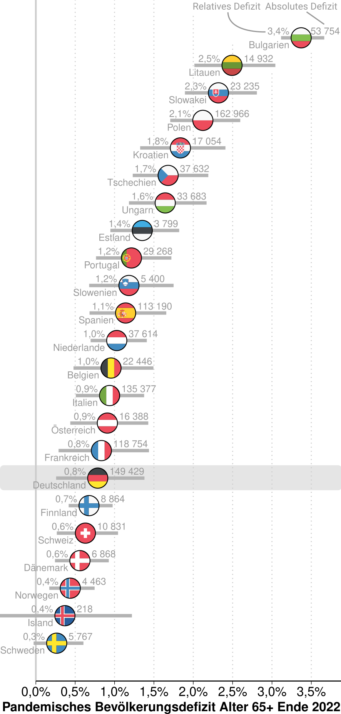

# Replication Materials for "Bevölkerungsalterung unter Pandemiebedingungen"

[Jonas Schöley](https://orcid.org/0000-0002-3340-8518)

In December 2022, the German Pension Insurance announced an estimated surplus of €2.1 billion for the past year. President Roßbach partly explained this balance with the "Corona Pandemic, which has led to an increase in mortality, especially among older people". Here I take a closer look at the demographics behind that statement. I calculate the pandemic related population deficit among ages 65 and above across Europe and look at population aging under conditions of continuously reduced life expectancy.

